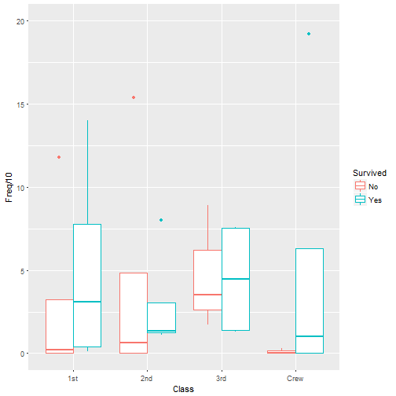
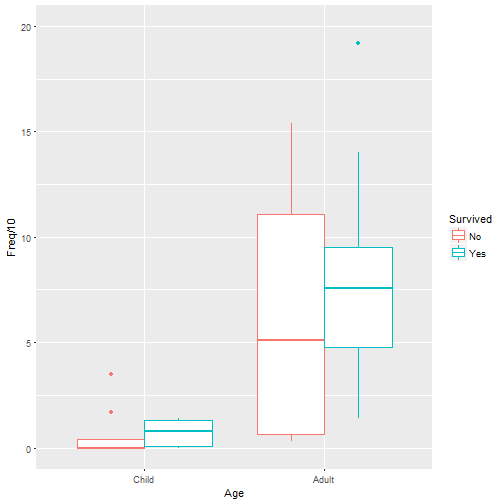
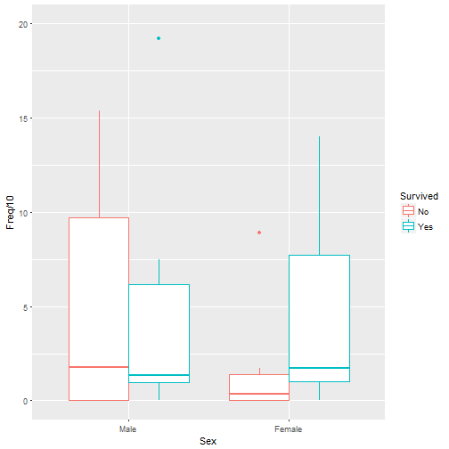

## Introduction

This presentation is created as a part of Week4 project for 'Building Data Products' course under Data Science Specialization from Johns Hopkins University.

This presentation is created using slidify.


## Getting the Data

I will use the "Titanic" dataset available in the {datasets} package in R. This dataset contains details of passengers who survived the sinking of Titanic, along with other properties like their class, age category and gender. The frequency term indicates the total number of survivors in that category.


```r
data("Titanic")
df_titan <- as.data.frame(Titanic)
```

---
## Survivors vs Class


```r
g <- ggplot(df_titan, aes(x = Class, y = Freq / 10, col = Survived))
g + geom_boxplot() + ylim(0, 20)
```



---
## Survivors vs Age


```r
g <- ggplot(df_titan, aes(x = Age, y = Freq / 10, col = Survived))
g + geom_boxplot() + ylim(0, 20)
```



---
## Survivors vs Sex


```r
g <- ggplot(df_titan, aes(x = Sex, y = Freq / 10, col = Survived))
g + geom_boxplot() + ylim(0, 20)
```


